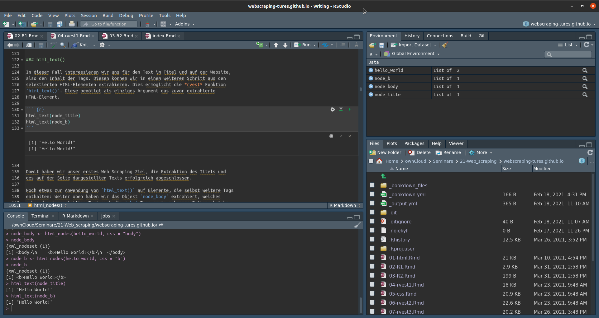

# R Basics {#R1}

``` {r, include = FALSE}
knitr::opts_chunk$set(collapse = TRUE)
knitr::opts_chunk$set(cache = TRUE)
knitr::opts_chunk$set(cache.path = 'cache/')
```

## Installation

In diesem Kurs werden wir mit der Sprache R in Kombination mit der
Entwicklungsumgebung RStudio arbeiten. Bevor wir mit der Einführung in die
grundlegende Bedienung beginnen, zunächst einige Worte zur Installation der
kostenlos zugänglichen Software.

### R

*R* ist eine Programmiersprache, die vor allem für statistische Analysen
angewandt wird. Generelle Informationen zu R und die ausführliche Dokumentation
finden sie unter: <https://www.r-project.org/>{target="_blank"}.

Die aktuellste Version von R für alle gängigen Betriebssysteme findet sich stets
im *CRAN*, dem *Comprehensive R Archive Network* unter:
<https://cran.r-project.org/>{target="_blank"}. Die Links zu den
Installationsdateien finden sich im oberen Bereich der Website.  Falls Sie
Windows nutzen, wählen Sie bitte die "base" Version. Im Falle von MacOS, hängt
die Wahl des Installers von der Version Ihres Betriebssystems ab.  In beiden
Fällen führen Sie bitte die passende Datei aus und Installieren Sie R in ein
Verzeichnis Ihrer Wahl. Für Linux Systeme stellt CRAN Installationsanweisungen
für einige der populären Distribution bereit.

Die Code Beispiele auf dieser Website wurden mit der R Version 4.1.1
"Kick Things" erstellt und getestet. 

### RStudio

R kann nun bereits ausgeführt werden, erlaubt aber nur die Nutzung einer
einfachen Konsole. Um die Arbeit mit R angenehmer zu gestalten, empfiehlt sich
dringend die zusätzliche Installation einer IDE -- Integrated Development
Environment -- also einer graphischen Benutzeroberfläche. Die populärste IDE ist
*RStudio*, zu finden unter: <https://www.rstudio.com/>{target="_blank"}. Unter
"Download" wählen Sie bitte die kostenlose Version von "RStudio Desktop" und den
passenden Installer für Ihr Betriebssystem.

Installieren Sie bitte zuerst R und erst danach RStudio. Starten brauchen Sie
dann in Zukunft nur noch RStudio.


## Erste Schritte

### Übersicht RStudio

``` {r rstudio_graphic, echo = FALSE, fig.retina = 1}

```

Das RStudio Interface besteht aus vier Unterbereichen. Links-unten finden Sie
die "Console" sowie weitere Tabs, die Sie zu Beginn selten bis nie brauchen
werden. Die Konsole kann genutzt werden, um R code einzugeben und auszuführen,
mehr dazu in Kürze. Links-oben werden geöffnete R scripts angezeigt. Aktuell
haben Sie noch kein script geöffnet, ab Kapitel \@ref(R2) wird dort aber der
überwiegende Teil unserer Arbeit stattfinden. Rechts-oben finden sich mehrere
Tabs, von denen für uns vor allem das "Environment" Tab von Interesse ist. Hier
werden alle Objekte gelistet die Sie in ihrem code erstellen. Auch hierzu in
Kürze mehr. Rechts-unten finden Sie erneute eine Anzahl Tabs. "Files" zeigt
uns die Dateistruktur unseres Rechners, "Plots" den graphischen output (siehe
Kapitel \@ref(R3)) und "Help" die Hilfedateien zu Funktionen und packages
(mehr in Kapitel \@ref(R2)).


### Hello World!

Nun können wir endlich damit beginnen unseren ersten R Befehl auszuführen. In
diesem Kapitel werden wir Kommandos noch ausschließlich in der Konsole
schreiben. In der untersten Zeile der Konsole sehen Sie ein `>` Symbol. Hinter
dieser Eingabeaufforderung können wir unsere Befehle schreiben und mit "Enter"
ausführen. Versuchen Sie des mit folgender Zeile:

``` {r hello_world_2}
print("Hello World!")
```

Sie haben gerade ihren ersten R Befehl ausgeführt, Ihren ersten Output erhalten
und gleichzeitig auch Ihre erste Funktion genutzt. Mehr zu Funktionen folgt am
Ende dieses Kapitels, fürs Erste genügt es aber zu wissen, dass `print()` alles
innerhalb der Klammern als Output druckt. Der Output selbst beginnt mit `[1]`,
was anzeigt, dass dies das erste und hier das einzige Element des Outputs ist.

Bitte beachten Sie, dass R die auf dieser Website vor dem Output dargestellten
`##` nicht abdruckt.

### Rechnen mit R

R versteht die arithmethischen Operatoren `+ - * /`. Sie können R also auch als
übergroßen Taschenrechner nutzen. Für fortgeschrittenere Rechenoperationen steht
eine Vielzahl von Funktionen zur Verfügung. Beispielsweise gibt Ihnen `sqrt()`
die Quadratwurzel der von den Klammern umfassten Zahl als Output zurück. Oben
mussten wir den Text `"Hello World!"` in Anführungszeichen einfassen. Zahlen
müssen hingegen ohne Anführungszeichen geschrieben werden. Potenzen bekommen wir
mit der Notation `x^y`. Im folgenden Codeblock finden Sie einige Beispiele, die
Sie Zeile für Zeile in die console tippen und mit "Enter" ausführen können:

``` {r calculator}
17 + 25
99 - 57
4 * 10.5
84 / 2
sqrt(1764)
6.480741 ^ 2
```


### Vergleichsoperatoren {#vergleich}

Vergleichsoperatoren können genutzt werden um zwei Werte miteinander zu
vergleichen und das Testergebnis als `TRUE` oder `FALSE` Output zu erhalten. Um
zu überprüfen, ob zwei Werte gleich sind, schreiben wir `== `. Dabei ist zu
beachten, dass ein Vergleich zweier Werte stets zwei Gleichheitszeichen
voraussetzt. `=` hat eine andere Bedeutung! Um zu testen ob zwei Werte *nicht*
gleich sind, können wir `!=` nutzen, wobei das `!` generell für *nicht* steht.

``` {r compare_1}
42 == 42
42 != 42
```

Weitere mögliche Vergleiche sind *kleiner* `<`, *kleiner gleich* `<=`, *größer*
`>` und *größer gleich* `>=`.

``` {r compare_2}
10 < 42
42 <= 42
10 > 42
90 >= 42
```


## Objekte

In R können wir Daten und Ergebnisse unserer Analysen in Objekten speichern. So
bleiben diese im Arbeitsspeicher erhalten und können später erneut aufgerufen
und weiterverwendet werden. Ein Objekt ist dabei ein frei gewählter Name dem wir
Daten zuweisen. Namen müssen dabei mit einem Buchstaben beginnen und sollten nur
weitere Buchstaben, Ziffern oder `_` beinhalten. Verbreitete Konventionen für
längere Objektnamen sind *snake case* -- `the_answer` -- und *camel case* --
`theAnswer`. Dies ist letztlich Geschmackssache, es empfielt sich aber eine
einheitliche Schreibweise sowie kurze aber klar verständliche Namen zu
verwenden. Daten weisen wir einem Objekt mit dem *assignment operator* `<-` zu.

``` {r answer_1}
the_answer <- 42
```

Um sich Fingerakrobatik zu ersparen, ist es sinnvoll sich frühzeitig die
Tastenkombination "Alt" + "-" anzugewöhnen, die `<-` an der aktuellen Cursor
Position einfügt.

Die so in einem Objekt gespeicherten Daten können wir aufrufen, indem wir den
Objektnamen als Befehl schreiben.

``` {r answer_2}
the_answer
```

Wir können Werte in Objekten auch direkt in Berechnungen oder in Funktionen
verwenden. Beachten Sie dabei, dass die Daten eines Objekts überschrieben
werden, wenn wir diesem neue Daten zuweisen.

``` {r answer_3}
the_answer <- the_answer / 2
the_answer

a <- 17
b <- 4
the_answer <- (a + b) * 2
the_answer
```

So erstellte Objekte werden in dem "Environment" Tab (rechts-oben) gelistet.
Möchten wir erstellte Objekte entfernen, können wir dazu die `rm()` Funktion
nutzen. Dies ist zwar in der Regel nicht notwendig, kann aber hilfreich sein um
versehentlich oder nur zum Test erstellte Objekte zu löschen und so den Tab
etwas aufzuräumen.

``` {r answer_42}
rm(the_answer)
```


## Vektoren

Als wir weiter oben eine Zahl einem Objekt zugewiesen haben, haben wir ohne es
zu wissen bereits unseren ersten Vektor erstellt. Vektoren sind eindimensionale
Datenstrukturen, die mehrere Elemente enthalten können. Die Länge eines Vektors
bestimmt sich dabei anhand der Anzahl seiner Elemente. So erstellt auch
`the_answer <- 42` einen Vektor, jedoch einen Vektor der Länge 1.

Möchten wir einen Vektor mit mehreren Elementen erstellen, nutzen wir dazu die
Funktion `c()`, wobei "c" für "combine" steht. So werden alle durch Kommata
getrennten Werte innerhalb der Klammern zu einem Vektor kombiniert.

``` {r vectors_1}
v <- c(7, 8, 9, 10)
v
```


### Subsetting

Möchten wir bestimme Elemente eines Vektors abrufen, nutzen wir *subsetting*.
Dazu schreiben wir die Position des gewünschten Elements innerhalb des Vektors
als Zahl in `[]` direkt nach dem Objektnamen. Um beispielsweise das erste oder
das dritte Element unseres Vektors abzurufen:

``` {r vectors_2}
v[1]
v[3]
```

Mehrere Elemente gleichzeitig rufen wir ab indem wir mehrere Positionen mit
`c()` kombinieren oder wir definieren mit `:` eine Spannweite von Positionen.


``` {r vectors_3}
v[c(1, 3)]
v[2:4]
```


### Typen von Vektoren

Betrachten wir den Vektor `v` im Environment, fällt auf, dass RStudio
`num [1:4]` vor den gespeicherten Werten abduckt. Dies drückt zum einen aus,
dass der Vektor die Länge 4 hat, zum anderen zeigt es den Typ des Vektors an.
Hier handelt es sich um einen numerischen Vektor -- *numeric*, ausgedrückt durch
"num" -- also einen Vektor der Zahlen enthält.

Um Imformationen zu Typ, Länge und Inhalt von Objekten zu erhalten können wir
auch die Funktion `str()` -- structure -- nutzen. Dies ist vor allem bei
komplexeren Objekten wie Listen oder Dataframes (mehr dazu später) hilfreich, um
einen ersten Überblick zu erhalten, ohne das komplette Objekt abzudrucken.

``` {r vectors_4}
str(v)
```

R kennt noch weitere Typen von Vektoren, wobei für uns vor allem die Typen
*logical* und *character* von Bedeutung sind.

Logische Vektoren können nur die Werte `TRUE` und `FALSE` enthalten. Diese
entstehen beispielsweise, wenn wir Vergleichsoperatoren für einen Test nutzen.

``` {r vectors_5}
x <- c(1, 7, 3, 5)
x >= 5
```

Wir können logische Vektoren aber auch selbst erstellen.

``` {r vectors_5b}
z <- c(TRUE, FALSE, TRUE)
z
```

*Character* Vektoren beinhalten Zeichenfolgen, sogenannte *strings*. Strings
müssen stets von Anführungszeichen umschlossen sein.

``` {r vectors_6}
char_v <- c("This", "is", "a", "character", "vector!")
char_v
```

Auch Character Vektoren können miteinander verglichen werden.

``` {r vectors_7}
"same" == "same"
"same" == "not the same"
"same" != "not the same"
```

Da wir mit Character Vektoren natürlich nicht rechnen können, kann es zu
Problemen kommen, wenn wir Zahlenwerte -- beispielsweise als Strings aus einem
Text ausgelesen -- als Character Vektor gespeichert haben.

``` {r vectors_8, error=TRUE}
a <- c(1, 2, 3)
b <- c("7", "8", "9")

str(a)
str(b)

a + b
```

Wir können R aber anweisen einen Character Vektor in einen numerischen Vektor
umzuwandeln.

``` {r vectors_9}
a + as.numeric(b)
```

Alle Typen von Vektoren können neben ihren nativen Inhalten auch `NA` enthalten,
die Repräsentation von fehlenden Werten in R.

``` {r vectors_10}
c <- c(1, 2, NA, 4)
c
```


## Weitere Datentypen

### Dataframes

Dataframes sind zweidimensionale Datenobjekte aus Spalten und Zeilen, also das
was wir uns im Allgemeinen unter einer Tabelle vorstellen. Spalten enthalten
benannte Variablen, Zeilen enthalten Beobachtungen. Um einen Dataframe zu
erstellen nutzen wir die Funktion `data.frame()` und definieren innerhalb der
Klammern benannte Spalten und ihre Inhalte, getrennt durch Kommata.

``` {r data_frame_1}
df <- data.frame(Name = c("Peter", "Mary"), Alter = c(42, 24), Weiblich = c(FALSE, TRUE))
df
```

R erkennt dabei automatisch, welche Datentypen die Spalten enthalten.

``` {r data_frame_2}
str(df)
```

Wir können Dataframes auch aus zuvor definierte Vektoren zusammensetzen.

``` {r data_frame_3}
name <- c("Peter", "Mary")
age <- c(42, 24)
female <- c(FALSE, TRUE)

df_2 <- data.frame(Name = name, Alter = age, Weiblich = female)
df_2
```

Da Dataframes zweidimensional sind, müssen wir beim Subsetting auch eine
Position für die Zeilen und Spalten angeben. Diese werden ebenfalls in `[]` nach
dem Objektnamen eingefasst und sind durch ein Komma getrennt. Vor dem Komma
steht die Position der Zeilen, nach dem Komma die Position der Spalten. Für
Spalten können wir statt der Position auch den Namen der Spalte nutzen.

``` {r data_frame_4}
df[1, 2]
df[1, "Alter"]
```

Extrahieren wir mehrere Zeilenelemente gleichzeitig, bekommen wir einen neuen
Dataframe zurück. Um eine ganze Zeile zu extrahieren, können wir den Wert der
Spaltenposition auch freilassen. Gleiches gilt für ganze Spalten, wobei wir beim
Subsetting einer einzelnen Spalte einen Vektor als Output bekommen, bei mehreren
erneut einen Dataframe.

``` {r data_frame_5}
df[1, 2:3]
df[1, ]
df[, "Alter"]
df[, c("Alter", "Weiblich")]
```


### Listen

Vektoren und Spalten von Dataframes können immer nur Daten eines Typs
enthalten. Mischen wir Datentypen, werden diese auf den kleinsten gemeinsamen
Nenner gebracht. Logische Werte können auch numerisch abgebildet werden, da
`TRUE` dem Wert 1 entspricht, `FALSE` dem Wert 0. In letzter Instanz können alle
Datentypen als Character Vektoren gespeichert werden.

``` {r data_mix}
log_vector <- c(24, TRUE)
str(log_vector)

char_vector <- c("Mary", 24, TRUE)
str(char_vector)
```

Möchten wir Datentypen mischen, können wir stattdessen Listen nutzen, welche
unterschiedliche Datentypen enthalten können.

``` {r list_1}
l <-list("Mary", 24, TRUE)
str(l)
```

Um Listen wieder aufzulösen, nutzen wir `unlist()`.

``` {r list_2}
unlist(l)
```

Listen können sogar andere Listen enthalten und sind so das flexibelste
Datenobjekt das R bereitstellt.

Beim Subsetting von Listen ist darauf zu achten, dass `[]` immer auch eine Liste
zurückgibt, selbst wenn diese nur noch ein Element enthält. Direkten Zugang zu
Elementen erhalten wir mit `[[]]`.

``` {r list_3}
str(l[1])
str(l[[1]])
```


## R Packages

Die R Welt ist offen und kollaborativ. Neben dem base R Package, das in der
Grundinstallation bereits enthalten ist, steht eine stetig steigende Zahl von
nutzergeschriebenen Packages zum Download zur Verfügung. Diese Packages haben
stets einen thematischen Fokus -- beispielsweise Datenbereinigung, graphische
Analyse oder Textanalyse -- und enthalten eine Reihe von Funktionen, die den
Einsatzbereich von R über das hinaus erweitern, was von den Originalentwicklern
geplant war, oder kompliziert gestaltete base R Ansätze durch neue
anwenderfreundlichere Funktionen ersetzen.

Packages, ihre Dokumentation und weitere Informationen werden ebenfalls auf CRAN
gehostet. Hier haben Sie auch bereits die Installationsdateien für R
heruntergeladen. Wenn Sie gleich ein Package direkt aus RStudio installieren,
greift die Software auf CRAN zu, um die erforderlichen Dateien herunterzuladen.

### Installieren und Laden

Packages installieren wir mit der R Funktion `install.packages()`, mit dem Namen
des packages in `""` zwischen den Klammern der Funktion. Wir werden im Laufe
des Seminars eine Reihe von Packages nutzen, darunter das **tidyverse**. Zur
Installation des core **tidyverse** packages schreiben wir in der Konsole:

``` {r package_install, eval = FALSE}
install.packages("tidyverse")
```

R wird während der Installation eine lange Reihe von Informationen ausgeben, von
denen uns -- solange alles gut geht -- nur das `DONE (tidyverse)` interessieren
muss. Nach erfolgreicher Installation können wir das Paket laden. Ein Package
laden wir mit `library()` mit dem Namen des Packages innerhalb der Klammern,
hier ausnahmsweise ohne `""`.

``` {r package_load_exmpl}
library(tidyverse)
```

Manche Pakete, wie das **tidyverse**, geben uns auch beim Laden eine Reihe von
Informationen, die wir gleich noch genauer betrachten werden. Andere Pakete laden
aber auch still, ohne Informationen in die Konsole zu schreiben. Sollte beim
Laden eines packages ein Problem auftauchen, wird R dies rückmelden.


## Funktionen

Bis zu diesem Punkt haben wir bereits eine Reihe von Funktionen genutzt, ohne
eigentlich zu wissen, was Funktionen sind. Die in base R und den diversen
Packages enthaltenen Funktionen bieten einen einfachen Zugang zu komplexeren im
Hintergrund ablaufenden Operationen. Statt beispielsweise eine komplizierte
Datenanalysetechnik selbst zu implementieren, also jeden Rechenschritt Zeile für
Zeile selbst zu schreiben, installieren wir ein Package mit einer passenden
Funktion und sparen eventuell mehrere hundert Zeilen Code ein. Außerdem sind die
Rechenoperationen in den Packages meist sehr viel effizienter geschrieben als
Code, den wir als Laien schreiben würden.

Um eine Funktion aufzurufen, schreiben wir deren Namen gefolgt von
Klammern. Innerhalb der Klammern geben wir ein oder mehrere Argumente an die
Funktion weiter. In vielen Fällen wird als erstes oder eniziges Argument ein
Datenobjekt -- oder rohe Daten -- angegeben, auf das die Funktion angewandt
werden soll. So "druckt" beispielsweise die base R Funktion `print()` die
angegebenen Daten in die Konsole, wie bereits bei `print("Hello World!")`
gesehen.

Weitere Beispiele für Funktionen sind einige der in base R enthaltenen
Möglichkeiten, statistische Maßzahlen zu berechnen. Legen wir zunächst einen
numerischen Vektor mit einigen Beispieldaten an:

``` {r numeric_exmpl_data}
data <- c(4, 8, 15, 16, 23, 42)
```

Unser Interesse sei es, das arithmetische Mittel, den Median sowie die
Standardabweichung der Daten zu berechnen. Dazu können wir die Funktionen
`mean()`, `median()` und `sd()` aus base R nutzen. Allen drei Funktionen geben
wir als einziges Argument die zuvor in einem Objekt gespeicherten Daten weiter.
Weitere Argumente sind zwar möglich, für dieses Beispiel aber nicht notwendig.

``` {r statsistical_standards}
mean(data)
median(data)
sd(data)
```

Funktionen erlauben häufig mehrere Argumente, von denen einige optional sein
können und es beispielsweise ermöglichen bestimmte Optionen einer Funktion zu
verändern. Dies wird uns im weiteren Verlauf regelmäßig begegenen.


### Namesspaces

Betrachten wir nochmals den Output nach dem Laden von **tidyverse** weiter oben.
R gibt uns neben Namen und Versionen der geladenen packages -- das core
**tidyverse** Package, welches wir geladen haben ist eigentlich eine Sammlung von
Packages -- auch die Information über zwei Konflikte aus. Konflikte entstehen,
wenn zwei geladene packages Funktionen mit den selben Namen enthalten. Die
Funktion aus dem später geladenen package überschreibt dabei die zuvor geladene
Funktion. Hier überschreibt das tidyverse package **dplyr** die Funktionen
`filter()` und `lag()` aus dem base R package **stats**. Ohne **dplyr**
beziehungsweise **tidyverse** zu laden wäre beim aufruf von `filter()` die
Funktion aus dem **stats** package genutzt worden. Nun wird die gleichnamige
Funktion aus **dplyr** angewandt.

Möchten wir zwar **dplyr** laden, aber die Funktion `filter()` aus **stats**
nutzen, können wir den Namespace der Funktion explizit angeben. Der Namespace
gibt R an, in welchem Package es nach der Funktion suchen soll. Geben wir nur
den Funktionsnamen an, sucht R in den Funktionen die aktuell geladen sind. Da
`filter()` aus **dplyr** die Funktion aus **stats** überschrieben hat, würde
erstere angewandt. Deklarieren wir den Namespace, können wir R genau angeben, in
welchem geladenen oder ungeladenen package die Funktion zu finden ist. Dazu
nutzen wir die Notation `namespace::function`. Um also `filter()` aus **stats**
zu nutzen, schreiben wir: `stats::filter()`.

## Hilfe?

### Hilfe!

Wir haben nun bereits einige R Funktionen kennengelernt und eine ungefähre Idee
davon, was diese machen. Wie bekommen wir aber weitere Informationen zu diesen
und neuen Funktionen, zu deren Funktionsweise, den zugelassenen Argumenten
oder den zurückgegebenen Ergebnissen?

Der einfachste Weg ist das Nutzen der eingebauten Hilfefunktionalitäten in R.
Dazu schreiben wir in der Konsole einfach ein `?` vor den Namen einer Funktion,
zu der wir Hilfe benötigen. Die zugehörige Hilfedatei öffnet sich dann im "Help"
Tab, rechts-unten. Versuchen wir dies für die Funktion `rnorm()`.

``` {r help, eval = FALSE}
?rnorm()
```

Die Hilfedatei gibt uns eine ganze Reihe von Informationen. `rnorm()` ist Teil
einer Familie von Funktionen, die sich auf die Normalverteilung beziehen. Dabei
ist es die Funktionalität von `rnorm()`, Zufallszahlen aus der Normalverteilung zu
generieren. Wir sehen auch, dass wir der Funktion 3 Argumente geben können. Die
Anzahl der zu erzeugenden Zufallszahlen `n` sowie Mittelwert `mean` und
Standardabweichung `sd` der zugrundeliegenden Normalverteilung. Dabei ist zu
erkennen, dass `mean` und `sd` die Standardwerte 0 beziehungsweise 1 haben.
Diese werden automatisch eingesetzt, wenn wir sie im Funktionsaufruf nicht durch
neue Werte ersetzen. `n` hat keinen Standardwert, hier müssen wir also einen
Wert angeben wenn wir die Funktion aufrufen.

``` {r rnorm_1}
rnorm(n = 10)
```

So bekommen wir 10 Zufallswerte aus der Normalverteilung mit dem Mittelwert 0
und der Standardabweichung 1. Da es sich um Zufallszahlen handelt, wird Ihr
Output von dem auf der Website dargestellten abweichen.

Möchten wir Mittelwert und Standardabweichung anpassen, können wir die
entsprechenden Argumente nutzen um die Standardwerte durch andere zu ersetzen.

``` {r rnorm_2}
rnorm(n = 10, mean = 10, sd = 0.5)
```

Die Hilfe gibt uns meist auch weitere detaillierte Informationen zur
Funktionsweise und dem Output (unter" Value") der Funktion, sowie eine Reihe
von Beispielsanwendungen. Diese Informationen richten sich oft aber an eher
erfahrene Nutzer.

Weiter Möglichkeiten sich zur Funktionsweise von Packages sowie R generell zu
informieren, finden Sie in Kapitel \@ref(R2).